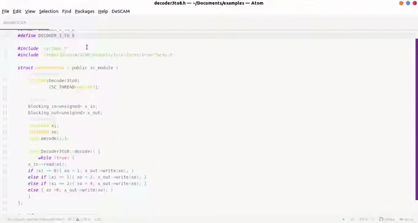

# DeSCAM

This package is being developed to facilitate property driven development (PDD) with the DeSCAM tool. it interfaces DeSCAM with Atom and complement that with additional features such as linting and CFG visualization.

## Features
Current runnable commands on a supported SystemC-PPA module are:
- **PrintITL**: prints a complete set of properties in ITL
- **PrintSVA**: prints a complete set of properties in SVA
- **PrintTrueOperation**: prints real operations
- **PrintSkeleton**: prints structure and FSM in AML
- **PrintChisel**: prints the module in CHISEL
- **PrintCFGDot**: prints the control flow graph in .dot file format
- **PrintCompleteness**: complete set of properties in ITL
- A systemC-PPA file is linted autmatically on save. feedback is provided in the form of errors,warnings and infos using the descamLinter(still under development). 
- It is also possible to visualize the dot file of the control flow graph, save it or copy it as an SVG or PNG image.

Required packages by the linter and control flow graph visualizer:
atom-linter
graphvisualizer preview plus

Please **do not forget** to set the bin folders of the DeSCAM tool and linter in the package settings.

 

